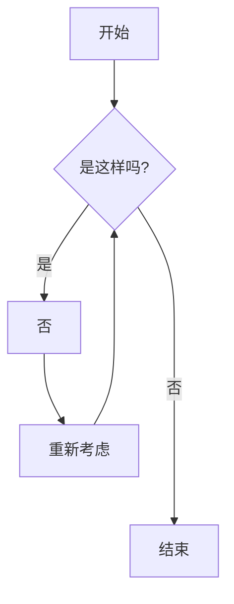

标题

# 一级标题 
## 二级标题 
### 三级标题 
#### 四级标题 
##### 五级标题 
###### 六级标题 

## 段落

原来女娲氏炼石补天之时，于大荒山无稽崖炼成高经十二丈、方经二十四丈顽石三万六千五百零一块。娲皇氏只用了三万六千五百块，只单单剩了一块未用，便弃在此山青埂峰下。谁知此石自经煅炼之后，灵性已通，因见众石俱得补天，独自己无材不堪入选，遂自怨自叹，日夜悲号惭愧。

## 文本样式

| 样式 | 语法 | 示例 | 输出 |
| --- | --- | --- | --- |
| 粗体 | `** **` or `__ __`| `**这是粗体文字**` | **这是粗体文字** |
| 斜体 | `* *` or `_ _`     | `_这是斜体文字_` | _这是斜体文字_ |
| 删除线 | `~~ ~~` | `~~这是错误的文字~~` | ~~这是错误的文字~~ |
| 粗体且内嵌斜体 | `** **` 和 `_ _` | `**这些文字 _非常_ 重要**` | **这些文字 _非常_ 重要** |
| 全部粗体且斜体 | `*** ***` | `***所有这些文字都很重要***` | ***所有这些文字都很重要*** |
| 下标 | `~ ~` | `这是 ~下标~ 文字` | 这是 ~下标~ 文字 |
| 上标 | `^ ^` | `这是 ^上标^ 文字` | 这是 ^上标^ 文字|

## 链接

[github](https://www.github.com)

## 图片


## 引用

> 后来，不知过了几世几劫，因有个空空道人访道求仙，从这大荒山无稽崖青埂峰下经过，忽见一大块石上字迹分明，编述历历。空空道人乃从头一看，原来就是无材补天，幻形入世，蒙茫茫大士、渺渺真人携入红尘，历尽离合悲欢、炎凉世态的一段故事。

## 水平线

***

---

_________________

## 脚注

这是一个简单的脚注[^1], 这是一个长一点的脚注。[^bignote]

[^1]: 这是第一个脚注。
[^bignote]: 这儿是一个脚注，包含了多个段落及代码。

    使用缩进，以使得段落被包含进脚注中。 

    `{ ...我的代码... }`

    加上你需要的任要段落。

## 无序列表

- 林黛玉
- 薛宝钗
- 贾宝玉

## 有序列表 

1. 孙悟空
1. 猪八戒
1. 沙和尚

## 嵌套列表

1. 西游记
   - 取经团队
     - 孙悟空
     - 猪八戒
     - 沙和尚
     - 唐僧

## 任务列表
     
- [x] 安装数据库
- [ ] 写导入数据的脚本
- [ ] 写功能脚本

## 代码块

```javascript
import { ref } from 'vue'
import { SmoothMarkdown } from '@smooth-markdown/core'
import { affixToolbar } from '@smooth-markdown/core/plugins'
import VuetifyToolbar from '@smooth-markdown/vuetify-toolbar'

const editor = ref(null)
const doc = ref('')
const plugins = [affixToolbar({
  offset: {
    top: 0,
    bottom: 0
  },
  style: {
    width: '100%'
  }
})]
```

## 行内代码

` npm install vue `

## 数学公式

行内公式: $a+b$

$$
\displaystyle \left( \sum_{k=1}^n a_k b_k \right)^2 \leq \left( \sum_{k=1}^n a_k^2 \right) \left( \sum_{k=1}^n b_k^2 \right)
$$

```math
\displaystyle \left( \sum_{k=1}^n a_k b_k \right)^2 \leq \left( \sum_{k=1}^n a_k^2 \right) \left( \sum_{k=1}^n b_k^2 \right)
```

## Mermaid

